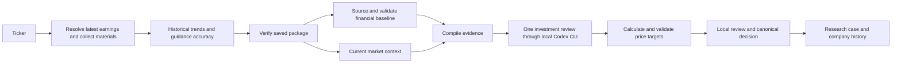

# Earnings assessment pipeline

An earnings assessment starts with a ticker. The acquisition workflow resolves the issuer and latest event, archives the transcript and all available event materials, and builds sourced historical trends. An unchanged saved package can be assessed again without rediscovering or re-extracting those materials.

## Responsibilities

The roles remain durable, independently inspectable stages. A role does not require a separate hosted model call.

| Role | Work | Execution |
| --- | --- | --- |
| Chief of Staff | Verify the saved company/event identity and route the assessment | Deterministic code |
| Source researcher | Verify the original archive and reuse the acquired material | Deterministic code |
| Evidence analyst | Acquire a missing financial anchor, validate atomic observations, compile trends and complete call exchanges | Code, with market and financial retrieval in parallel |
| Investment reviewer | Answer opportunity, valuation, catalyst, downside and portfolio action; choose and defend forecast assumptions | One Codex CLI generation |
| Calculator and local reviewer | Check financial bindings, compute scenario arithmetic, retain review receipts and apply portfolio constraints | Deterministic arithmetic and existing local Laya review |

The optimized path is selected by `assessment_pipeline=earnings-assessment.v1` on a new earnings handoff. A free-form universe question still requires issuer discovery and screening; it cannot acquire this shortcut merely by claiming a ticker. Historical cases retain their original task and attempt records.

Regular company investigations also collect the latest earnings after candidate
discovery and before the five-question synthesis. They keep the original question,
holding horizon and research route. See [the shared investment process](investment-process.md)
for the integration, source reuse and comparison with other agent frameworks.

## Price target contract

New earnings assessments require a supported base target, bear/bull scenarios, a denomination, a forecast period, a target horizon and retained calculation inputs. The first missing or invalid target receives one bounded corrective generation; it cannot publish a completed report with a null target. Failed research remains visible and recoverable.

For a profitable operating company, the calculator supports:

1. A validated, dated reported diluted EPS baseline.
2. Explicit additions/subtractions for independently validated nonrecurring per-share items within that baseline's fiscal period.
3. Annual EPS growth assumptions with business reasoning for each scenario.
4. Exit P/E assumptions with separate valuation reasoning for each scenario.
5. Code-calculated forecast EPS and price: `adjusted baseline × (1 + annual growth)^forecast years × exit multiple`.

The forecast span and the target horizon are separate. For example, a FY2025 annual baseline projected to FY2027 requires two growth steps even when the share-price target is twelve months from the assessment date. Older baselines are displayed with their dates and applicable age limitations. They are never silently renamed current earnings.

The valuation engine also retains DCF, enterprise-multiple and NAV methods, with full per-scenario calculation records. A loss-making issuer cannot receive a positive P/E valuation by ignoring its negative earnings. Each alternative requires its own supported inputs; missing financial anchors require further acquisition, not fabricated financial statements.

Portfolio sizing is separate. Missing account balances, holdings or risk limits can restrict an allocation without erasing a supported company valuation. Price targets are conditional research estimates, not reported company facts or promised outcomes.

After the bounded earnings reviewer supplies an independently recalculated target,
remaining quote, portfolio and optional filing/supplement gaps stay visible without
automatically launching another discovery → synthesis → CIO review. This policy
applies only to `earnings-assessment.v1` with verified package lineage and frozen
financial inputs. A missing or invalid target still receives its bounded correction
and cannot publish; local review, recommendation gates and trade restrictions remain
unchanged. Explicit source refresh or reassessment can revisit unresolved gaps.

For an older assessment already blocked by such an automatic continuation,
`Repository.reconcile_earnings_assessment_followup(run_id)` provides an idempotent
recovery. It requires a current published original CIO decision, a recalculable
target and no running attempt or other unfinished work. It cancels only unfinished
first-generation continuation tasks, retaining their failed attempts, errors and
outputs. The assessment completes with its decision and unresolved gaps unchanged;
an audit receipt preserves the prior blocked state and scoped dispatch is revoked.

## Evidence and reproducibility

- The workflow, namespace, ticker, original requested sources, versions and content hashes are checked before each code-owned stage and final review.
- Supplemental SEC financial evidence is archived and frozen on the assessment. It does not alter the original earnings package.
- An exact SEC concept, reporting currency, period, unit and issuer identity must support a financial seed. A bare dollar sign does not establish USD.
- Recognized operating observations are independently reconstructed from the original reporting header and exact metric clause before becoming reusable facts. Membership/cardholder measures, renewal geographies, current/prior periods, gross-margin levels and basis-point changes cannot be substituted for one another. Unsupported wording remains cited context.
- The full latest call and earnings release retain original line locators, including late-call questions and management qualifiers. Historical trend observations retain their source bindings. Coverage and any supplemental-document omissions are explicit. A compiler receipt records the context hash and size.
- The financial evidence cutoff is frozen after retrieval and before preparation commits. Newly retrieved SEC evidence cannot be mistaken for information from the future solely because retrieval finished after the run was created.
- Final review references saved fact IDs. Output-local compiler aliases never masquerade as reusable fact IDs.
- A provider-only projection replaces duplicated full SEC JSON-line excerpts with their exact annual EPS records after independently rechecking the frozen hashes, versions and financial bindings. Other fact metadata, the complete call/release and trend evidence remain unchanged. A separate diagnostic receipt records the substitutions; source archives and durable fact records are not rewritten.
- Preparation supplies the exact historical EPS input row, including its original period, unit and accounting basis. The provider schema fixes that row and its optional scalar alias to the saved value and bindings; other supported calculator inputs retain their own shapes. Forecast fiscal-year labels belong to the valuation method, not to a rewritten historical fact. The calculator independently checks the copied row again.
- Valuation fact IDs refer only to numerical financial operands proven by the financial parser and matched to current, saved fact records. Operating observations inform scenario rationales and question answers through their citations; declaring them as financial operands is rejected. An unvalidated share-price header cannot become an extra valuation input or a newly verified quote.
- The verified single-company provider contract requires one matching candidate, a structured valuation method and all three scenario objects. It places these before narrative fields, so a prose price cannot substitute for calculator inputs. The shared historical and generic research contracts stay compatible.
- Arithmetic, source verification, freshness and portfolio policy remain code-owned. The reviewer cannot certify its own facts.
- Local review revalidates against the entire exact source packet frozen for its attempt, including the issuer document needed to bind SEC concept data. Every supporting source must still match its retained namespace, version and content hash.
- `earnings_assessment_links` preserves earlier assessments when a user chooses **Reassess with saved materials**. **Research → All research** and **Research → Company history** show the same canonical price target and frozen sources.
- Pausing background research remains authoritative. A scoped run authorization dispatches only the chosen assessment.

Large filings receive bounded financial and risk excerpts with original line locators and explicit omission coverage. They cannot displace the complete latest call or earnings release. Further material types need an explicit evidence projection before the reviewer can claim to have read them.

Historical metric extraction is cached per document and runs with at most three concurrent Codex generations. Cache identity includes the entire archived text, source metadata, namespace, model policy, schema, instructions and validator version. Cached observations are rebound and revalidated against the current archive before charting; a new quarter does not re-extract unchanged prior calls.

## Research Engine integration

The workflow uses the shared source archive, provider admission pool, immutable task/attempt history and canonical case-decision store. **Research → Company history** reads the same valuation as the research case. Existing watchlist and learning projections therefore retain their normal decision lineage. Portfolio inputs come from the dated account snapshot; they cannot be invented from an earnings transcript. Congress, strategy and general research workflows keep their existing routes and do not run merely because an earnings assessment starts. Their future evidence adapters can reuse these contracts while retaining their own data and validation requirements.

## Runtime and authentication

The app runs the installed `codex exec` command with ChatGPT subscription authentication. It checks `codex login status`, requires ChatGPT login, and forces that login method for execution. No OpenAI API key is required by this workflow. Model and reasoning choices remain the configured policy; the optimization removes redundant work rather than silently changing the user's model.

This uses the [ChatGPT sign-in path in the official OpenAI documentation](https://learn.chatgpt.com/docs/auth#sign-in-with-chatgpt). Authentication credentials are neither read into research packets nor copied into the project.

## Validation and performance

`test_assessment_pipeline.py` exercises the complete task graph, checks that only one hosted call runs, proves the calculated target reaches the canonical decision, verifies a missing target is repaired once and cannot publish, and confirms unrelated queued cases remain paused. Parser and valuation tests separately reject wrong issuer, source version, period, unit, currency, unsupported facts and invalid arithmetic.

Returned provider usage is retained before output validation. A rejected proposal still consumed a call; its receipt survives the bounded correction and later failure. An adapter failure that never returns usage remains unknown, not zero.

The earlier observed COST run took 52m 06s and produced no target. A completed full-call warm reassessment took 19m 06s including one corrective generation and published independently recalculated bear/base/bull values of USD 667.16 / 959.39 / 1,176.16 in both Results and Library. All fourteen analyst exchanges were retained. This measures reassessment of saved materials, not cold collection. The duplicate-input projection and operand schema guard were installed afterward, so their additional live latency effect is unmeasured. Detailed timings, failed development trials and qualifications are in [the latency audit](research-latency-audit.md).

The optimization removes unnecessary model requests, uses code for deterministic work, runs independent retrieval in parallel and reduces duplicated context and output. The execution route remains the installed Codex CLI and its existing ChatGPT login.
