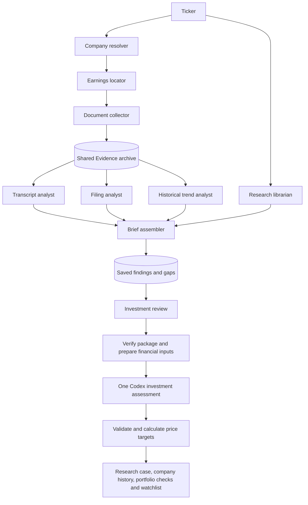

# Ticker-driven Research Engine workflows

**Research → Earnings & materials** starts with a ticker. Selecting **Analyze latest
earnings** runs a saved recipe that locates the newest reported earnings event,
collects its earnings materials, researches numerical history, and connects the results to the
rest of the Research Engine. The user does not have to find or upload documents,
write individual agent prompts, or select the filing type.

## Agent architecture

| Agent | Responsibility | Output and completion rule |
| --- | --- | --- |
| Company resolver | Resolve ticker to CIK; verify exact ticker against official SEC submissions. | Company identity, SEC metadata, verification date/hash. A discovered CIK alone is insufficient. |
| Earnings locator | Find the latest reported event, primary release and candidate call transcripts. | Fiscal period, actual earnings date, expected filing form and archived release. Dates and issuer must appear in the fetched primary release. |
| Earnings material collector | Fetch the call, release, presentations, supplements, prepared remarks, shareholder letters and earnings filings through the safe public-source connector. | Event-matched sources, hashes, dates and verification checks; CDN documents retain the issuer link as provenance. |
| Transcript analyst | Analyze verified call text using the existing local rules. | Speaker tone, names, business themes and exact sentence evidence, with the input source lineage. |
| Filing analyst | Optionally compare equivalent narrative sections when both periodic filings exist. | Added, removed and changed commentary; missing filings do not block the earnings package. |
| Historical trend analyst | Collect and validate recent-quarter metrics, five completed years of capital spending and dated guidance. | Numeric series, exact quotes and source IDs; forecasts and actuals remain distinct, with explicit coverage gaps and guidance-versus-actual comparisons. |
| Research librarian | Attach existing company research and portfolio/watchlist context plus dated historical archives. | Related cases, library findings, portfolio records, Congress disclosure snapshot and saved-strategy context. It does not infer current holdings from old disclosures. |
| Brief assembler | Package successful outputs and unresolved gaps. | One saved package that can be partial, failed or complete, with an evidence-backed investment-research handoff. |

The locators and source-bound numerical extractor use the configured A01/firm
Codex model and the existing global provider admission pool. Extraction disables
web and command tools; deterministic validation checks proposed observations.
The other document agents are bounded Python services.
An agent is a responsibility with a versioned input/output contract; it does not
need a separate model process for every task. Existing investment research owns
valuation, scenario analysis, risk, decision review and proposed portfolio action.

The workflow engine owns dependency ordering and durable state. Independent
ready agents can run together. Two workflows can execute concurrently, with at
most twenty active/queued workflows admitted and existing provider limits still
governing all model calls. The research librarian can run while sources are found;
transcript and filing analysis can run concurrently once collection finishes.

## Correct document selection

1. Verify the company against `data.sec.gov/submissions/CIK##########.json`.
   If the SEC ticker directory is unavailable, discovery may suggest a CIK, but
   official submissions must confirm the ticker before it is used.
2. Locate the latest **actually reported** event as of the run date. An upcoming
   call announcement, calendar, search snippet or model-generated summary is
   not the earnings release. Reject events older than a newer SEC report period
   or a newer Item 2.02 earnings announcement in an 8-K, including while the
   corresponding periodic filing is still pending.
3. Verify the issuer, earnings date, fiscal period end and reported results in a
   fetched primary release. The expected periodic report is a 10-K for
   fourth-quarter/full-year results or a 10-Q for interim quarters; either
   remains optional until published and readable.
4. Select the filing by exact SEC `reportDate` and form. A later earnings release
   may precede its periodic filing; the previous quarter's report must never be
   silently presented as the current one.
5. Compare against the most recent earlier report of the same form. Annual
   reports therefore normally compare year over year. A first-quarter 10-Q can
   compare against the previous fiscal year's third-quarter 10-Q; both actual
   dates and the comparison basis remain visible. This is a narrative comparison,
   not a same-quarter financial-growth calculation.
6. Verify that transcript text matches the company, quarter and actual call
   date, contains sufficient readable speech, questions and a closing section.
   Extract the spoken span to keep site navigation and editorial summaries out
   of sentiment analysis. Short excerpts, paywall prompts and webcast pages do
   not pass as complete transcripts.
7. Archive the canonical fetched page before analysis. The transcript analyst
   deterministically extracts speech from that saved page and checks its separate
   input hash. Earnings and general research therefore share the same source
   version even though their analysis uses different portions of its text.
   Public filing copies are labeled as mirrors and
   checked against SEC company/form/report-period metadata. They are not claimed
   to be byte-for-byte identical to the SEC original.

Transcript speaker parsing supports inline labels and separate name/title lines.
Operator introductions identify the person asking a question; ambiguous job titles
remain unknown rather than becoming invented management responses. Reader summaries
use two to five short bullets where possible, capped at eight per discussion, with
verbatim quotations bound to each attributed speaker. A discussion that cannot be
faithfully summarized within the limit remains available as full source text with
an explicit explanation gap.
Acquisition checks that the same reader can identify management speech and an
answered analyst exchange. Unsupported layouts try the next candidate. Intact
archived transcript URLs for the exact issuer and earnings event are tried before
another search, with a fresh fetch and the current validation checks. A new case
also rechecks a cached package's available transcript before reusing it; existing
frozen case evidence remains unchanged.

The acquisition path uses existing HTTPS/DNS checks, redirect validation,
request timeouts and document-size limits. It does not bypass source access
controls. Foreign issuers that report on 20-F/6-K, scanned documents, and sources
without enough readable verification evidence currently produce explicit gaps.

Earnings presentations are first-class sources. A deck with an explicit earnings
presentation cover and reporting quarter/year can match an already verified
event even when the cover omits the call date. Historical recovery additionally
requires that date to match a retained event document or official SEC Item 2.02
metadata; a comparative quarter buried in a slide is insufficient.
An issuer URL that redirects to its PDF host retains a code-generated receipt
with both URLs, the fetched PDF hash and the extracted-text hash. This permits
verified issuer-to-CDN delivery without treating an unverified CDN URL as an
issuer source. Linked CDN documents retain the separate issuer-page proof.

Quarterly capital spending is separate from the five-year annual series and
annual guidance. The deterministic quarterly parser reads the column labels in
an issuer cash-flow reconciliation, preserves cash PP&E and finance-lease
principal as separate operands, and adds them only when that presentation
explicitly defines capex that way. A matching same-table quarter's archived SEC
USD cash fact establishes the dollar denomination. Charts with unlabeled spatial
associations, YTD totals, forecasts, missing operands or ambiguous currencies
remain evidence gaps. Every accepted value retains its table, column, PDF page,
source hash, calculation and currency proof. These checks are covered by
[`test_quarterly_capex.py`](../backend/tests/test_quarterly_capex.py).

Official reference: [SEC submissions API documentation](https://www.sec.gov/search-filings/edgar-application-programming-interfaces).
The collector also follows the SEC's [developer access guidance](https://www.sec.gov/about/developer-resources).

SEC fetching shares a process-wide request gate across discovery, earnings and
the submissions connector. It permits four request starts per second and applies
host-specific cooldowns after 403/429 responses; a denied archive host does not
disable the structured-data host. A bounded inspection of the denial identifies
explicit undeclared-automation or rate-limit messages without archiving error
HTML as evidence. Unknown denials stay unknown. See [SEC setup and troubleshooting](setup.md#troubleshooting)
for private contact configuration and cooldown bounds. There is no immediate
retry loop against a denied host; issuer documents remain eligible fallbacks.

For a saved event, `EarningsAcquisition.refresh_missing_filings` can create a
revised acquisition packet without repeating transcript analysis or model
discovery. It preserves available documents, rechecks missing official periodic
filings against SEC identity and the research-date cutoff, and retries failed
same-event earnings 8-Ks plus their observed same-accession exhibit links.
The result reports changed filings for deterministic comparison and rebuilds
the affected coverage gaps. Callers save it as a new revision; the prior packet
is never edited.

## Saved state and reproducibility

Migration `021_research_workflows.sql` adds workflow runs, per-agent checkpoints
and an append-only event history to the existing SQLite database. Document text
remains in the shared Evidence store; checkpoints retain source references and
hashes. Analysis artifacts use the existing private document-analysis archive,
with workflow ID, namespace, source lineage, input text and analysis version.

The workflow version is `earnings.v2`. Acquisition and each analysis method also
have versions; transcript analysis is `local-document-nlp.v2`, and
annual/quarterly narrative alignment is `local-filing-comparison.v2`.
Model discovery can vary between attempts. Its
outputs are treated as candidates and subjected to the same deterministic source
checks. Replaying a saved analysis uses its archived input, not a changed webpage.

- **Duplicate requests:** concurrent requests for the same ticker, recipe and
  namespace share the active job. Optional request keys provide durable retry
  protection; reusing a key for another ticker is rejected.
- **Restart:** queued/running jobs resume at incomplete checkpoints on app start.
  Previously completed steps are retained.
- **Retry:** partial/failed jobs rerun incomplete steps and their dependants.
  Collection refreshes availability for the verified event. A new run checks for
  a newer earnings event. There is no endless automatic retry loop.
- **Cancellation:** active model tasks are cancelled through the existing adapter;
  cancelled document computations cannot write late analysis records. Explicitly
  cancelled jobs do not automatically restart.
- **Coverage:** missing calls and numerical-history gaps keep a package partial.
  Optional filing comparisons and unavailable supplementary documents have
  separate coverage notes. Available call analysis is readable while historical
  collection runs; missing periodic filings do not block the earnings review.
- **History:** old recipe records remain readable after version changes. Resuming
  an incompatible recipe requires a new run rather than reinterpreting its graph.
- **Backup:** workflow checkpoints and archived source text are in SQLite; saved
  analysis files are under `data/evidence/`. Use the existing full backup for both.
- **Research lineage:** once a workflow has handed its evidence package to a
  research case, create a new workflow for further collection. This keeps the
  reviewed package and its research-case link stable.

## Integration with the rest of the engine

| Existing feature | Integration now | Boundary |
| --- | --- | --- |
| Evidence | All validated documents use the shared archive and source IDs. | Discovery snippets do not become facts. |
| Research | Regular company investment research collects earnings after candidate discovery and before the five-question synthesis. An earnings-first request can also create an explicit assessment with its saved package. | Preserve the original question, horizon and case; source versions and gaps remain attached. Paused investment research stays queued. |
| Portfolio / Watchlist | The librarian attaches matching retained records. Investment review applies the existing decision and portfolio checks. | The earnings recipe does not edit positions or create a trade. |
| Congress trading | Matching retained disclosure records and the snapshot date accompany the package. | Historical disclosure data is context, not a current-position assertion or automatic signal. |
| Strategy testing | Saved studies are surfaced as available context. | No backtest is launched without its explicit assumptions and date range. |
| Research → Company history | Matching historic company findings are linked to the fresh package. | Historic findings remain dated and are not silently refreshed. |
| Reddit | Accepted company ideas enter the same earnings prerequisite before investment synthesis. | Screening still comes first; the shared collector reuses verified material instead of maintaining a separate Reddit scraper. |
| Monitoring | Durable recipes provide a callable entry point that future scheduled triggers can reuse. | This change does not enable a new recurring collector or notification schedule. |

Explicit document workflows run even when investment research is paused, as the
existing manual document tools do. The investment-research handoff honors the
firm pause state. No trading or external messaging is introduced.

Verified earnings handoffs now use the [assessment pipeline](assessment-pipeline.md):
local routing and evidence preparation followed by one Codex investment review,
with one bounded correction if its required price target fails validation.
**Reassess with saved materials** creates a new revision for a terminal assessment
while retaining its earlier sources and decisions. An in-flight assessment is
reused instead of duplicated. General research keeps its original discovery route,
then includes the shared earnings prerequisite for company candidates. The
[investment process](investment-process.md) shows how the stages fit together.

## API and extension points

All mutations use the app's existing local-client guard.

| Method | Path | Purpose |
| --- | --- | --- |
| GET | `/api/research-workflows/catalog` | Available recipes and agent descriptions. |
| POST | `/api/research-workflows/runs` | Start with `{ "ticker": "COST", "workflow": "earnings", "namespace": "real" }`. |
| GET | `/api/research-workflows/runs?limit=25` | Compact saved history. |
| GET | `/api/research-workflows/runs/{id}` | Progress, saved package and hydrated analysis results. |
| POST | `/api/research-workflows/runs/{id}/retry` | Retry incomplete work for the same verified event. |
| POST | `/api/research-workflows/runs/{id}/cancel` | Cancel active work. |
| POST | `/api/research-workflows/runs/{id}/research` | Create/reuse an investment research case. |

Implementation is separated into `research/workflows.py` (recipe registry,
lifecycle and earnings handlers), `research/earnings_sources.py` (acquisition),
`research/earnings_trends.py` (numerical history and guidance comparisons),
`api/research_workflows.py` (typed API), existing document-analysis services and
`EarningsWorkflow.tsx` (progress/results UI). `WorkflowSpec` declares the graph,
critical agents and result-producing agent. Recipe dispatchers register the
capabilities used by each agent. Adding a recipe requires an explicit graph,
dispatcher/capability implementation and API allowlist entry, with a new version
and fixture coverage; it is not done by asking a model to invent a workflow.

Natural next recipes are filing-only refresh, company research refresh, and
disclosure-driven research. They can reuse source collection, document analysts,
the librarian and the investment-research handoff while keeping feature-specific
inputs explicit. Scheduled earnings watches would call the same durable run
entry point and deduplicate on company/verified event, rather than introduce a
second prompt loop. See [earnings materials and numerical context](earnings-trends.md)
for the trend schema, measurement rules, reader and saved-review behavior.

## Verification

The regression suite covers exact source lineage, SEC filing-period selection,
annual/quarterly narrative mapping, stale/wrong issuer rejection, complete-call
checks, pending filings, partial findings, retry dependencies, duplicate requests,
restart recovery, cancellation during analysis, namespace checks, recipe-version
changes, model setup failures, API guards and paused/idempotent research handoff.

The live COST check uses its [September 24, 2026 earnings release](https://investor.costco.com/news/news-details/2026/Costco-Wholesale-Corporation-Reports-Fourth-Quarter-and-Fiscal-Year-2026-Operating-Results/default.aspx),
the public [Q4 FY2026 transcript](https://stockanalysis.com/stocks/cost/transcripts/682005-q4-2026/),
and [official SEC submissions](https://data.sec.gov/submissions/CIK0000909832.json).
Source checks on September 25 found the current-year 10-K pending. This is an
expected partial-evidence outcome, not permission to substitute the older 10-Q.

Final acceptance on September 25, 2026:

- All **689 backend tests passed**; the production frontend build passed.
- A ticker-only COST request through the main application's HTTP API resolved
  the issuer, found the release and transcript, saved their source lineage and
  produced analysis of **448 sentences across 17 speakers**, including 278 Q&A
  sentences. Its FY2026 filing comparison correctly remains pending.
- A retry reused the verified event, refreshed acquisition and retained matching
  canonical-source and extracted-input hashes. The saved result is available in
  Documents → Latest earnings → Saved workflows.
- The research handoff was checked in the isolated QA copy: it retained the
  source IDs and preserved the firm's paused state.
- Subsequent browser acceptance covered the saved COST shareholder journey on
  desktop and mobile, including themes, complete question/answer context, exact
  transcript jumps and a verified full-text download. See the
  [earnings UX review](earnings-ux-review.md) for the final checks and limitations.
