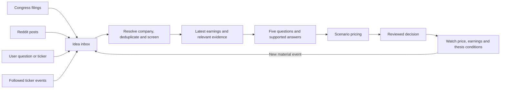

# One investment process, four idea sources

Design proposal, September 26, 2026. This document distinguishes current
capabilities from proposed work; it does not enable collectors or start research.

The target experience is a single Research inbox. Ideas arrive from congressional
disclosures, Reddit, a user question or ticker, and followed companies. Opening an
idea shows why it arrived and the same earnings, questions, pricing and decision
process, with its source and review date retained.

## Current coverage

| Source | Present | Work remaining |
| --- | --- | --- |
| User question | Discovery, preserved request and horizon, earnings prerequisite, five questions and canonical decision | Simple ticker intake and the shared idea record |
| Reddit | Polling/checkpoints, source deduplication, screening and bounded research dispatch | Join the common inbox while preserving original posts and intake failures |
| Congress | Existing scheduled collection, local disclosure archive and extraction receipts | Connect newly verified receipts to the displayed feed and screened research intake |
| Watchlist | Conditions on existing decisions can reopen a case | Follow tickers before a case exists, detect new earnings and bind fresh evidence to a new review episode |

The existing Congress collector has a collection-only policy that forbids
launching research agents. A future investment-intake bridge must explicitly
update that policy when it is enabled; refreshing the archive alone must not
silently start paid research.

## A shared idea record

Each adapter produces the same durable record:

- Origin, original request/claim, original URL and external event ID/version.
- Resolved ticker and issuer, or an explicit unresolved identity.
- Occurrence date, publication/filing date and collection time, kept separate.
- Exact source IDs, versions and hashes, with extraction/verification status.
- User horizon and scope where supplied; collection must not replace them.
- Existing company/case/episode links, screening outcome and the reason for priority.

Deduplication has two levels. The same source event/version is imported once.
Different sources referring to the same company event can enrich an existing
review, with each origin retained. A filing amendment or new earnings period is
a new version/event, not a duplicate to discard. Multiple-ticker questions keep
their shared comparison scope; informational questions need not become stock
recommendations.

Inbox states should distinguish received, needs identity/evidence review,
screened out, ready for research, researching, decision ready and watching.
Receiving a filing is not equivalent to finishing an investment review.

## Reuse the existing research engine

Adapters feed the existing orchestrator, source archive, earnings collector,
five-question contract, calculator and canonical decision store. Preserve global
pause, scoped dispatch, cancellation and user-question priority. No replacement
agent framework or change to local Codex CLI authentication is needed.

For Congress, verify the source receipt and security identity before screening;
retain transaction and filing dates, disclosed amount ranges and amendments.
Show last successful collection separately from the newest filing date. A
disclosed purchase supplies an investigation lead, not a valuation or instruction
to buy. Unresolved extractions remain review items rather than model inputs
masquerading as verified transactions.

For followed tickers, check inexpensive event metadata first. New earnings,
amended material, an established price condition or a dated thesis checkpoint
can justify research. A routine poll with no relevant change should not repeat
full transcript extraction or a complete investment review.

## Review episodes and fresh earnings

The current per-run earnings receipt intentionally remains fixed on retry.
Watch monitoring can reopen the same run for later review. These two behaviors
need an episode-level contract before watchlist earnings refresh is reliable.

Bind each new review episode to its event, financial cutoff, earnings workflow
package hash and exact source versions. Retry within an episode reuses its
evidence; a later earnings event creates a new episode and performs a fresh
event check. Earlier questions, answers, prices and decisions continue to use
their original packages. A newer review must never rewrite the source bindings
of a saved assessment.

## Useful patterns from the reference repositories

These are proposed adaptations, not claims that the repositories already
implement this application's four-source intake.

| Reference | Pattern worth adapting | Specific improvement here |
| --- | --- | --- |
| [Dexter](https://github.com/virattt/dexter) | Research planning, tool selection, self-checking, loop limits and financial-question evaluations | Add specific missing-evidence tasks beneath the five questions, with retrieval/call budgets and an explicit stopping reason |
| [TradingAgents](https://github.com/TauricResearch/TradingAgents) | Bull and bear research followed by risk/portfolio review | A bounded opposing-case pass cites contrary evidence, identifies unresolved disagreements and records what would invalidate the thesis |
| [FinRobot](https://github.com/AI4Finance-Foundation/FinRobot) | Financial research and valuation feeding a traceable report | Extend the existing calculator with clearer operating-driver explanations and peer comparisons, keeping reported facts separate from forecast assumptions |
| [AI Hedge Fund](https://github.com/virattt/ai-hedge-fund) | Repeatable fund mandates and historical evaluation | Apply explicit horizon, universe and portfolio constraints; evaluate saved research and forecasts against later observations |

Existing source checks, code-calculated valuations, review history and paper
outcomes provide much of the foundation. Additional agent roles should address
a measured gap rather than duplicate an existing reviewer. Repository descriptions
are architectural references, not evidence of investment performance.

## Earnings reading experience

The implemented reader uses retained transcript sentences and speaker turns.
Theme and negative-language cards show a quoted preview: the analyst's question,
excerpts from each management responder and nearby context. Inline links open
the original transcript passage, and the return action restores the reader's
theme/filter and page. Readers can also expand the full speaker text directly
below a preview. These are source excerpts, not generated interpretations of
whether management resolved the question.

A lexical negative-word match is a navigation cue. A phrase such as "not seeing
a material headwind" must retain its negation and management context. A recorded
management reply does not prove that the question was resolved. Existing local
analysis has no semantic per-exchange summary, so extractive summaries must be
labeled as quotes. A future generated interpretation must cite sentence IDs,
check quotations against the original text and expose unresolved ambiguity.

Opaque amber highlights with dark text, a visible outline and a "Cited passage"
label identify source locations without depending on subtle color changes.

## Delivery order and acceptance checks

1. Earnings quoted previews and contrasting highlights are implemented. Consolidating the Research navigation remains proposed.
2. Add the shared inbox and verified Congress receipt adapter.
3. Add ticker subscriptions and episode-bound earnings refresh.
4. Add bounded evidence follow-up, focused opposing-case review and evaluations.

Acceptance checks should include: repeated events do not create duplicate model
runs; amendments remain visible; a new quarter refreshes earnings while old
decisions stay unchanged; pausing stops new dispatch; omitted call context is
reported; source jumps reach the quoted words; comparison tickers cannot share
the wrong evidence; entry conditions are separate from future valuation targets.

Measure source accuracy, supported-answer coverage, missing-data recovery,
forecast errors, duplicated research avoided and total tokens per idea. Collection,
trend extraction, failed attempts and revisions belong in the same cost total.
