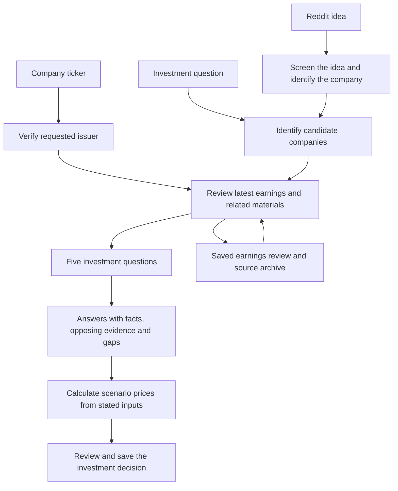

# Earnings within the investment process

The company investment process is:

**Ticker → latest earnings → five questions → supported answers → pricing → decision.**

The proposed next step is [one idea inbox for Congress, Reddit, user requests
and followed tickers](idea-intake-roadmap.md), reusing this research process.

The original question, requested holding horizon and research case remain the
same throughout. Reddit screening still decides whether a post contains an
investigable idea; a broad question can first discover candidate companies.
Once a company enters investment research, its earnings evidence belongs to
that case rather than requiring a separate manual handoff.

An informational question can end with a direct answer. An ETF, currency or
commodity needs evidence appropriate to that asset; it must not be assigned a
company earnings call. An unavailable company release or transcript is an
explicit coverage gap, never evidence that earnings were reviewed successfully.

## What each stage produces

| Stage | Saved result |
| --- | --- |
| Identify | Issuer identity and the scope of the original question |
| Earnings | Latest reported event, available IR release, call and related filings; historical metrics and guidance comparisons |
| Five questions | Opportunity, valuation, catalyst, downside and portfolio action |
| Answers | Evidence, interpretation, opposing explanations and unresolved questions |
| Pricing | Reported financial baseline, labeled forecasts, bear/base/bull assumptions and code-calculated values |
| Decision | Review outcome, conditions, uncertainties and portfolio implications where the account information supports them |

The final decision is saved only after the calculation and review checks. These
are logical responsibilities, not a requirement for six separate model calls.
The earnings-only route can prepare evidence in code and use one investment
review generation. A general question can require additional discovery and
synthesis to answer its original scope.

A regular single-ticker request whose routing result agrees with the original
ticker prepares its earnings sources directly. It does not spend another model
call rediscovering an investment candidate the user already named. SEC identity,
the latest primary release, and archived source hashes are verified before this
preparation is recorded as complete. The usual analyst and final reviewer still
answer the five questions, calculate supported prices and make the decision.
Broad questions, conflicting identities and multiple candidates keep their
bounded discovery path. A missing verified primary release blocks preparation;
optional transcript or filing gaps remain visible on a usable package.
The event locator identifies only the latest release and its dates. Transcript
discovery follows that verified event in the collector; an unavailable optional
transcript cannot discard an otherwise valid primary release.

Provider discovery retains a bounded `discovery-accounting.jsonl` diagnostic
alongside its worker receipt. It records safe event names, hashed operation IDs,
query/action counts and final outcomes, without search text or raw reasoning.
Started/completed updates for the same operation are reconciled, and every query
inside a batch counts toward the existing limit. A failed owned earnings
prerequisite requires an explicit task retry; opening or resuming the case alone
does not authorize another search.

The CLI can represent a completed page open as an `other` action with an
explicitly empty query or a complete URL. Those observed shapes consume a web
action without consuming a search query. An empty start is provisional: a later
search completion supplies the actual batch size. An explicit search for a URL
still counts as a search. Missing or malformed terminal metadata is rejected.

Ordinary single-company reviews receive compiler-validated financial operands
alongside the earnings discussion. The analyst's committed facts give the final
reviewer durable IDs for code-calculated targets; a truncated raw SEC JSON page
is not treated as adequate financial preparation. When a supported financial
baseline is ready, final review must supply valid scenario calculations. Missing
or unsuitable baselines remain named gaps. The evidence cutoff is frozen after
earnings, interim releases, financial data and market observations are acquired;
later analyst retries reuse those observations rather than shifting the cutoff.

Peer discovery is optional enrichment. Its completed, partial or failed receipt
is retained for the case, so a synthesis retry does not silently repeat a failed
peer search. Unavailable peers remain gaps while supported company financials
can proceed. A failure before provider dispatch leaves a pending task that can
be explicitly retried without rerunning completed earnings work.

Source collection and investment judgment have separate identities. A refreshed
earnings package can be read without changing an older investment decision.
Each saved decision continues to use the document versions that supported it.
Deleting unrelated questions must preserve the selected case's linked earnings
package, transcript analysis and sources. A stale page selection must fall back
to an available review instead of making retained research appear deleted.

A new case can reuse a verified package only when the latest event was checked
within the previous hour. Rebuilding charts does not renew that check. Once
attached, the package is fixed for that investigation; retrying a later stage
does not silently change its quarter or evidence. Company comparisons keep a
separate earnings receipt and valuation context for each ticker.

The same pause and cancellation controls apply to earnings collection and the
investment review. Restoring or opening a saved review does not start a new
model run. Materials that could not be acquired, and evidence omitted from a
bounded model input, must remain visible as coverage gaps.

## Why this is agentic

This is a structured agentic research workflow. Its agents can choose searches,
select tools and evidence, interpret results and request bounded follow-up
research. The application controls stage order, persistence, source validation,
calculation and stopping conditions. Ordinary downloads and arithmetic remain
code responsibilities. An agent role does not need to be a separate process or
model call.

This matches the distinction between prescribed workflows and agents that
dynamically direct tool use in [Anthropic's architectural explanation](https://www.anthropic.com/engineering/building-effective-agents).
It does not imply that the application executes trades or that its investment
judgments are accurate merely because multiple agents participated.

## Comparable open-source projects

References inspected September 26, 2026. These are architectural comparisons,
not installed dependencies or claims of investment performance.

| Project | Relevant pattern | Application here |
| --- | --- | --- |
| [FinRobot](https://github.com/AI4Finance-Foundation/FinRobot) | Equity research, financial analysis, valuation and report generation; its README distinguishes the open-source V0/V1 from later offerings | Study the open equity-research components and evidence-to-report structure |
| [TradingAgents](https://github.com/TauricResearch/TradingAgents) | Analyst roles, opposing researchers and risk/portfolio review | Use independent challenge and clear handoffs where they add useful evidence |
| [Dexter](https://github.com/virattt/dexter) | Financial questions become research plans, tool calls and checked answers; execution has loop/step limits | Study bounded source discovery and failure recovery |
| [AI Hedge Fund](https://github.com/virattt/ai-hedge-fund) | Analyst signals, portfolio construction and risk constraints with a shared fund-cycle model | Keep company research, allocation and risk responsibilities separate |

These projects have different provider and data requirements. Studying their
patterns does not replace this application's existing Codex CLI execution and
authentication, or add an API-key requirement to this workflow.
