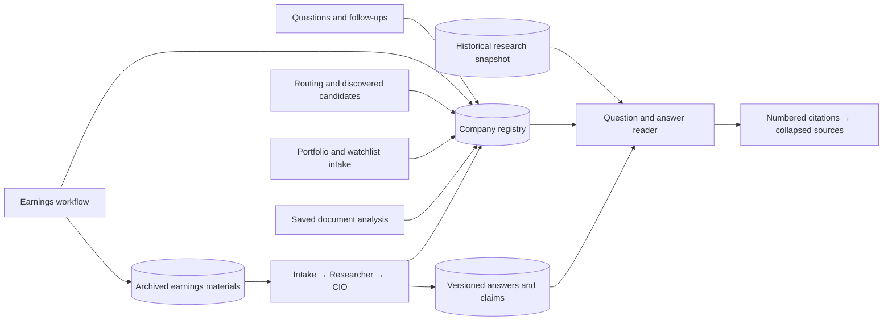

# A persistent company Research Library

The library is the company's research record across intake, earnings analysis,
investment research and later reviews. A ticker is retained when introduced;
an unanswered company stays visible while research is queued or in progress.
Capturing a company does not imply that its identity, investment thesis or
portfolio holding has been verified.

## Capture and isolation

`research_library_entries` has one durable identity per namespace and normalized
ticker. `research_library_mentions` preserves each origin and links a research
run or earnings workflow without creating another company card. Write hooks use
the caller's transaction, so capture commits alongside the originating action.
Free-form questions use conservative symbol recognition; the routing and
discovery stages add explicit symbols after resolving the research universe.

Startup backfill recovers earlier research, documents and portfolio intake.
Repeated capture and backfill are idempotent. Real, demo and simulation records
remain separate. The historical research database stays a read-only snapshot;
the reader merges a historical company and live company by ticker and retains
its prior bookmark, packets and decision history.

## Reading contract

The detail page renders questions followed by answers. Each answer has its own
closed Sources dropdown. Selecting a numbered citation opens that dropdown and
focuses the corresponding source; source links then open the retained public
URL. Historical question-level references remain answer-level citations, while
explicit inline references retain their location. A general bibliography does
not become evidence for an arbitrary answer.

Current company questions come from saved research and CIO case decisions.
Historical revisions keep their own answers and source associations. Missing
answers, unavailable sources and unresolved evidence are displayed explicitly.
The reader does not generate conclusions or silently upgrade an uncertain claim
to a verified fact.

An Evidence gaps dropdown retains validated archive-recovery limitations for
the selected review. Its contents follow that revision's run, remain separate
from answer citations and do not rewrite an agent's saved output.

## Executing a selected case while background research is paused

The earnings workflow's research handoff archives the evidence IDs in a normal,
idempotent research run. When the firm is paused, that case remains queued.
An explicit `run_once` action on `/api/control` dispatches only the selected run
without changing the firm pause or releasing unrelated queued work.

The durable authorization is checked at orchestration, task pause checks and
the atomic provider-start boundary. It includes bounded continuation tasks
inside that case, never child research runs. Explicit pause/cancel and terminal
run status revoke it. Restart recovery preserves the existing requirement to
resume interrupted work explicitly.

The normal Researcher/CIO evidence checks, configured models, portfolio context
and provider limits remain in force. Library capture itself does not authorize
new model work or external portfolio actions.

## Earnings evidence when supplemental discovery cannot finish

A verified earnings handoff already carries an archived company evidence
packet. Exceeding the supplemental discovery tool limit must remain visible,
but should not discard that packet or prevent a conditional assessment of it.
The archive fallback is a code-owned dependency receipt, separate from an agent
answer. It links the exact failed attempt, the originating earnings workflow,
the source versions and hashes, and the gaps that downstream analysis must keep.

The failed search attempt remains failed and has no invented output. Only a
valid receipt can satisfy that discovery dependency. The Researcher and CIO
still receive the retained documents and explicit uncertainty about incomplete
discovery, valuation and holdings; they must defer unsupported conclusions.
Unrelated failures, ordinary unverified research requests, changed source
versions and cancelled work do not qualify. Recovery itself does not lift firm
pause or dispatch another case.

For this degraded path, additional automatic public-search continuation is
deferred. The original Researcher-to-CIO review can finish with explicit unknowns
instead of immediately repeating the failed search. A later review can supply
new evidence; the failed attempts and their limitations stay in history.

The initial fallback is tied to one failed attempt. If an explicit later retry
fails again, start a fresh review to use archive recovery again; the old receipt
cannot authorize a different failed attempt.

## Complete earnings context

Verified earnings handoffs give the Researcher and CIO the latest transcript
before other archives, including the full management Q&A when it fits the
100,000-character transcript limit. The overall evidence budget remains
320,000 characters. Omitted or partial transcript lines are recorded explicitly.
Historical trend observations, dated capex guidance comparisons and management
explanations travel in a separate bounded context, rebound to their original
source versions, hashes, quotes and line locators. Quote matching does not
replace the stricter investment-fact validation or imply independent support.

New five-question provider responses must include five question entries for
each candidate. The repository still rejects duplicate or missing question
keys, and a retry retains unknowns instead of dropping unanswered questions.

For a completed earnings case, `refresh_earnings_context` appends a Researcher
and CIO revision using the same frozen archive. It preserves earlier outputs,
does not rerun discovery or retrieve new market data, and does not dispatch
until explicitly authorized with `run_once`. The reciprocal workflow link and
every source version are checked again at dispatch. The case's existing fact
budget still applies; revisions reuse retained fact IDs. A failed stage uses
the ordinary targeted `retry` action instead.
